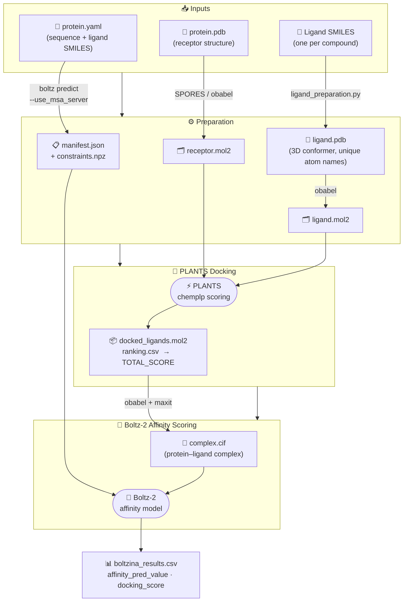

# BOLANTS

**BOLANTS** (BOLtz-2 + plANTS) is a molecular docking and affinity prediction pipeline that combines [PLANTS](https://github.com/purnawanpp/plants) docking with [Boltz-2](https://github.com/jwohlwend/boltz) scoring.

This project is a fork of [Boltzina](https://github.com/ohuelab/boltzina), replacing AutoDock Vina with PLANTS as the docking engine.



## What changed from Boltzina

| | Boltzina (original) | BOLANTS |
|---|---|---|
| **Docking engine** | AutoDock Vina | PLANTS |
| **Ligand format** | PDBQT | MOL2 |
| **Receptor format** | PDBQT (Meeko) | MOL2 (SPORES/obabel) |
| **Score source** | `REMARK VINA RESULT:` | `ranking.csv → TOTAL_SCORE` |
| **Config** | Vina grid txt | PLANTS `.conf` file |

## Installation

```bash
git clone https://github.com/itsraiko/BOLANTS.git
cd BOLANTS
bash setup.sh
```

`setup.sh` does the following automatically:
1. `pip install .` — installs all Python dependencies (boltz, openbabel, pdb-tools, …)
2. Downloads Boltz-2 model weights to `~/.boltz/`
3. Downloads and builds **maxit** from source

**PLANTS** must be installed separately (platform-specific binary):
```bash
# Download from: https://github.com/purnawanpp/plants
chmod +x /path/to/PLANTS
```
Then set `plants_bin` in your `config.json`, or add PLANTS to your `PATH`.

> **SPORES** (optional): if installed and in PATH, BOLANTS uses it instead of obabel for better MOL2 atom-type assignment. Download from the same PLANTS repository.

## Quick Start

### Step 1 — Prepare input files automatically

If you have a protein PDB, a SMILES file, and the binding site coordinates:

```bash
python prepare.py \
    --protein  protein.pdb \
    --smiles   ligands.smi \
    --center   X Y Z \
    --output   my_run \
    --plants_bin /path/to/PLANTS
```

SMILES file format (`ligands.smi`):
```
O=C(N...)c1n...   ZINC000343638897
CC(=O)Nc1...      ZINC000012345678
```

This generates `my_run/config.json` and all required files automatically.

### Step 2 — Run

```bash
python run.py my_run/config.json --float32_matmul_precision medium
```

For GPUs with limited VRAM (e.g. RTX 4060), use `--float32_matmul_precision medium` to avoid OOM errors.

Results are saved to `my_run/results/boltzina_results.csv`.

## Configuration File

```json
{
    "receptor_pdb": "protein.pdb",
    "boltz_yaml": "protein.yaml",
    "output_dir": "path/to/results",
    "plants_config": "plants_input.conf",
    "plants_bin": "/path/to/PLANTS",
    "fname": "my_protein",
    "input_ligand_name": "UNL",
    "ligand_files": [
        "ligand1.pdb",
        "ligand2.pdb"
    ]
}
```

**`boltz_yaml`** (recommended): BOLANTS will automatically run `boltz predict` before docking if the Boltz-2 output does not yet exist. No need to run it manually.

**`work_dir`** (optional): If you have already run `boltz predict` and want to reuse the output, set this to the boltz results directory (e.g. `boltz_results_base/boltz_results_myprotein`). If omitted, BOLANTS derives it from `boltz_yaml`.

**`use_msa_server`** (optional, default `true`): Set to `false` to skip `--use_msa_server` when running `boltz predict`.

**PLANTS config** (`plants_input.conf`):
```
scoring_function  chemplp
search_speed      speed1
bindingsite_center  X  Y  Z
bindingsite_radius  10.0
cluster_structures  5
cluster_rmsd        2.0
```

> `protein_file`, `ligand_file`, `output_dir` are added automatically — do not include them in the conf.

## Pipeline

```
1. boltz predict protein.yaml           (auto, if boltz_yaml is set)
2. receptor.pdb  →  receptor.mol2       (SPORES or obabel)
3. ligand.pdb    →  ligand.mol2         (SPORES or obabel)
4. PLANTS docking → docked_ligands.mol2 + ranking.csv
5. MOL2 → PDB → CIF                    (obabel + maxit)
6. Boltz-2 affinity scoring
7. boltzina_results.csv
```

## Command Line Options

| Option | Description |
|---|---|
| `--num_workers N` | Parallel docking workers |
| `--float32_matmul_precision` | `highest` / `high` / `medium` |
| `--skip_docking` | Skip docking, only run Boltz-2 scoring |
| `--vina_override` | Re-run docking even if output exists |
| `--boltz_override` | Re-run Boltz-2 scoring even if output exists |
| `--keep_intermediate_files` | Don't clean up intermediate files |

## Reference

Furui, K, & Ohue, M. Boltzina: Efficient and Accurate Virtual Screening via Docking-Guided Binding Prediction with Boltz-2. AI for Accelerated Materials Design - NeurIPS 2025. https://openreview.net/forum?id=OwtEQsd2hN
